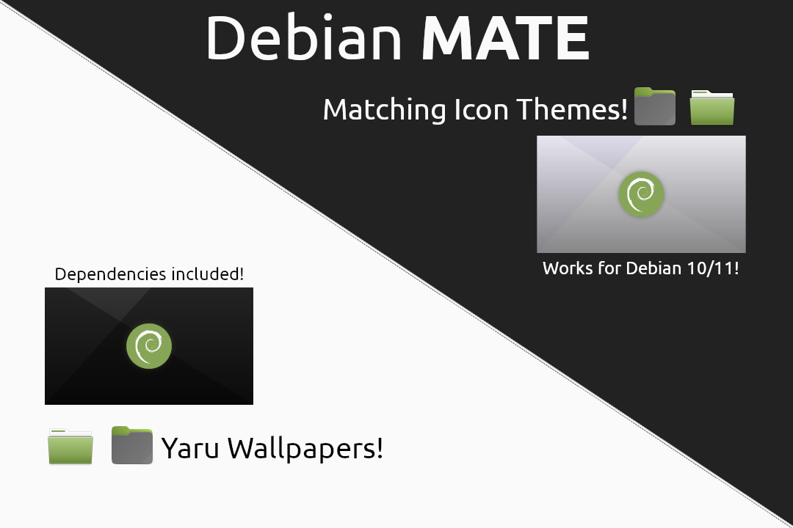

# Prelude

I shall not receive any credit for this because work isn't mine, I just
grabbed the Ubuntu MATE themes & rebranded them to fit Debian 9 Stretch
for personal use.

Since Debian 9 does not have the Ubuntu Humanity Icons, I decided to
package these icons with most of it's dependencies included & I'll 
also try to include wallpapers & other UM stuff rebranded for Debian
(As long as the license permits it)

If you want to cooperate you are free to.

# Dependencies
Ambiant Mate, Radiant Mate & Ambiant Mate Dark depend on `gtk 3.22`.

# To Do List

:heavy_check_mark: Finish adding base icons

:heavy_check_mark: Recolor orange ubuntu icons

:heavy_check_mark: Add Debian wallpapers

- [] Add more mimetypes

# Copyright
These icons will maintain their original upstream licenses being:

 * GPL v2 for Humanity Icons
   * Canonical Ltd.
   * Daniel Foré
   
 * GPL v3 for Ubuntu Mate Icons
   * Martin Wimpress.
   * Jack Mohegan.
   * Michael Tunnell.
   
   Note, these icons include the following licenses:
   
   Licenses: 
   
   * **CC-BY-SA-3.0**
   * **CC-BY-SA-4.0**
   
   Background licenses:
   
   * **CC-BY-SA-4.0**
   
   Plymouth licenses:
   
   * **GPL-2+**
   
   
**NEW!** Added Humanity Colors from @Ravefinity

A big thanks to the people who is making this possible:

* @flexiondotorg (Martin Wimpress)
* @Raveit65
* @danrabbit (Dabien Foré)

- Ravefinity Icons
    * Jared sot <ravefinity@gmail.com>
    * Jennie Petoumenou
    * Jonian Guveli <jonian.guveli@gmail.com>
    * K.Vishnoo Charan Reddy<foo.mac.v@gmail.com>

GNOME icons and Humanity icons are all licensed under the GPL.

Icons based on Tango sources or taken from the Tango project are public domain.
	You can visit the Tango project website here:
		http://tango.freedesktop.org/Tango_Desktop_Project

